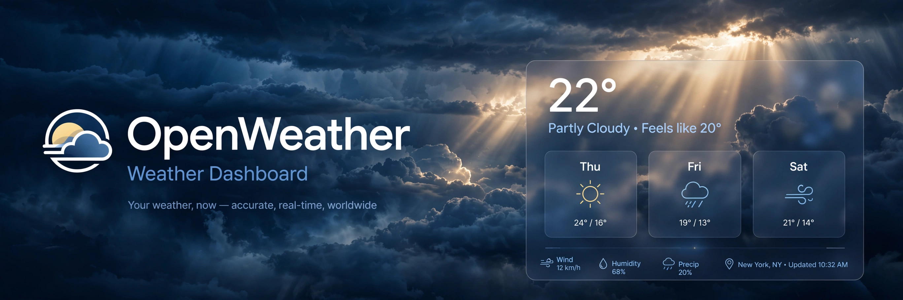
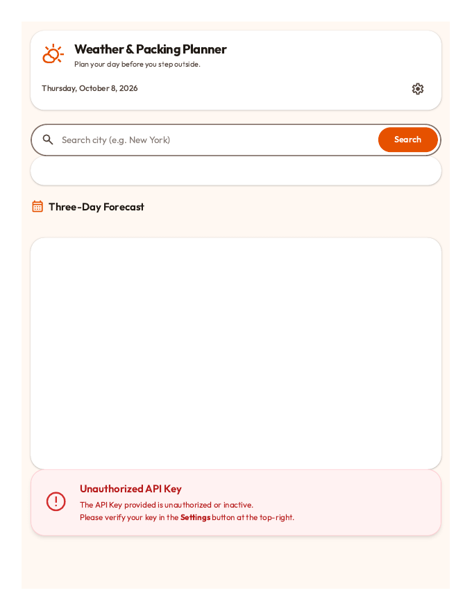

# OpenWeather — Weather & Packing Planner

> ## Status: 🟡 In Progress
>
> <progress value="80" max="100"></progress>
> **Progress: 80%** — Feature-complete frontend; needs a live API key to fully run.

<p align="center">
  
</p>


## Screenshots

<p align="center">
  
  <br />
  <em>Weather & packing planner UI (needs API key for live data).</em>
</p>


## What it is

A weather dashboard and trip packing planner built as an advanced frontend exercise. Enter a city and it shows current conditions plus a forecast, then generates a packing list tuned to the weather (rain gear, layers, sun protection). It has city search with autocomplete, a 5-item search history, metric/imperial unit toggle, dynamic weather-driven theming, and persists your preferences in `localStorage`. A Vercel serverless layer (`api/`) proxies OpenWeatherMap so the API key never ships to the browser.

## What works (verified)

- ✅ State management — central `state` object (units, history, city, theme, fetch status) — `app.js`
- ✅ City search with geocoding autocomplete and keyboard navigation — `app.js`, `api/geocoding.js`
- ✅ Current weather + forecast fetching with loading states — `api/weather.js`, `api/forecast.js`
- ✅ Packing list generator driven by conditions — verified in `app.js` packing logic
- ✅ Dynamic theming — UI theme follows the active weather condition
- ✅ Units toggle (metric/imperial) + search history persisted to `localStorage`
- ✅ Serverless proxy keeps the API key server-side (`process.env.OPENWEATHER_API_KEY`) — no key in client code
- ✅ Mockups — `dashboard_mockup.png`, `packing_infographic.png`

> Verified by reading `app.js`, all three `api/` functions, and `index.html`. Not run end-to-end here: it needs a real OpenWeatherMap API key and a browser.

## Tech stack

| Layer | Tech |
|---|---|
| Frontend | Vanilla JavaScript (ES modules), HTML, CSS |
| Backend | Vercel serverless functions (`api/`) |
| Data | OpenWeatherMap API (key via env / localStorage) |
| Design | Material Design principles, Material Symbols |

## How to run

```bash
# Option 1: static preview (API calls need a key)
npx serve .
# then open http://localhost:3000 and set your API key in the UI
# (stored in localStorage as weather_planner_api_key)

# Option 2: full stack on Vercel
vercel env add OPENWEATHER_API_KEY
vercel deploy
```

Get a free key at [openweathermap.org](https://openweathermap.org/api).

## Screenshots

| | |
|---|---|
|  |  |

## What you can add more

- [ ] Offline mode — cache the last forecast so the page works without network
- [ ] Hourly forecast strip — currently daily-focused
- [ ] Packing checklist persistence — let users check items off and save trips
- [ ] Severe-weather alerts — surface warnings from the API
- [ ] Multi-city comparison — compare weather across destinations
- [ ] PWA install support — it already feels like an app

## Project structure

```
OpenWeather/
├── index.html              # Dashboard markup
├── app.js                  # State management, theming, packing logic
├── style.css               # Material-style UI
├── api/
│   ├── weather.js          # Current-conditions proxy
│   ├── forecast.js         # Forecast proxy
│   └── geocoding.js        # City search proxy
├── dashboard_mockup.png
└── packing_infographic.png
```

---
*README written after code audit on 2026-10-08.*
