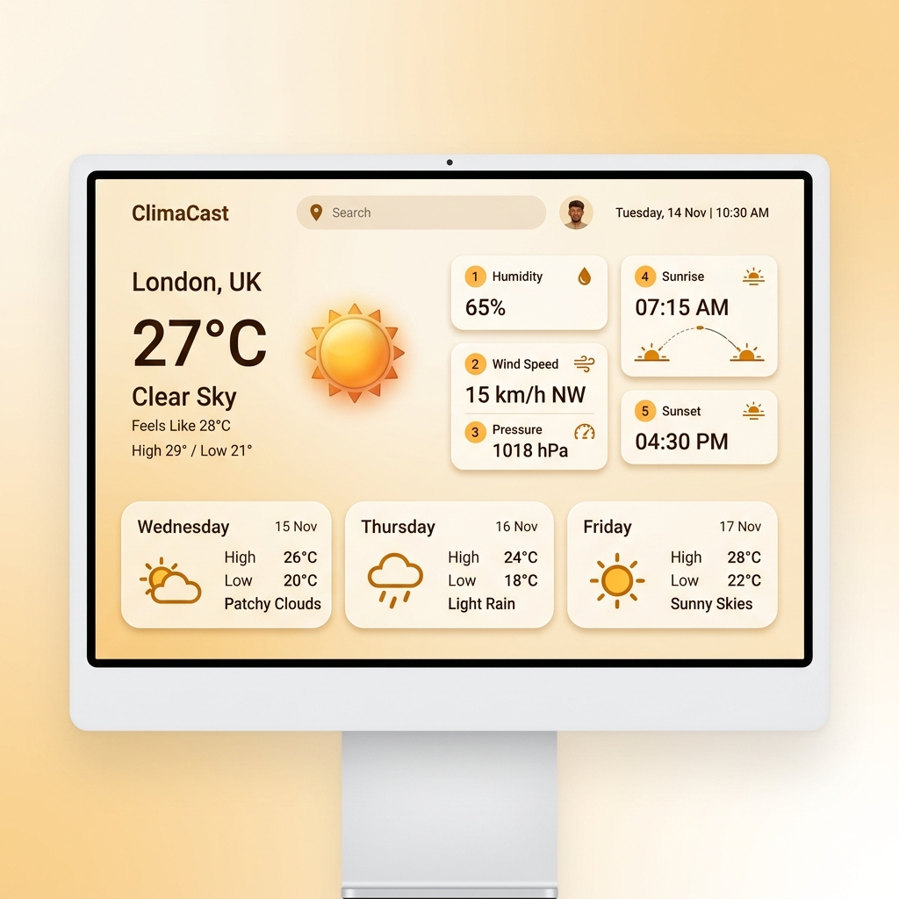
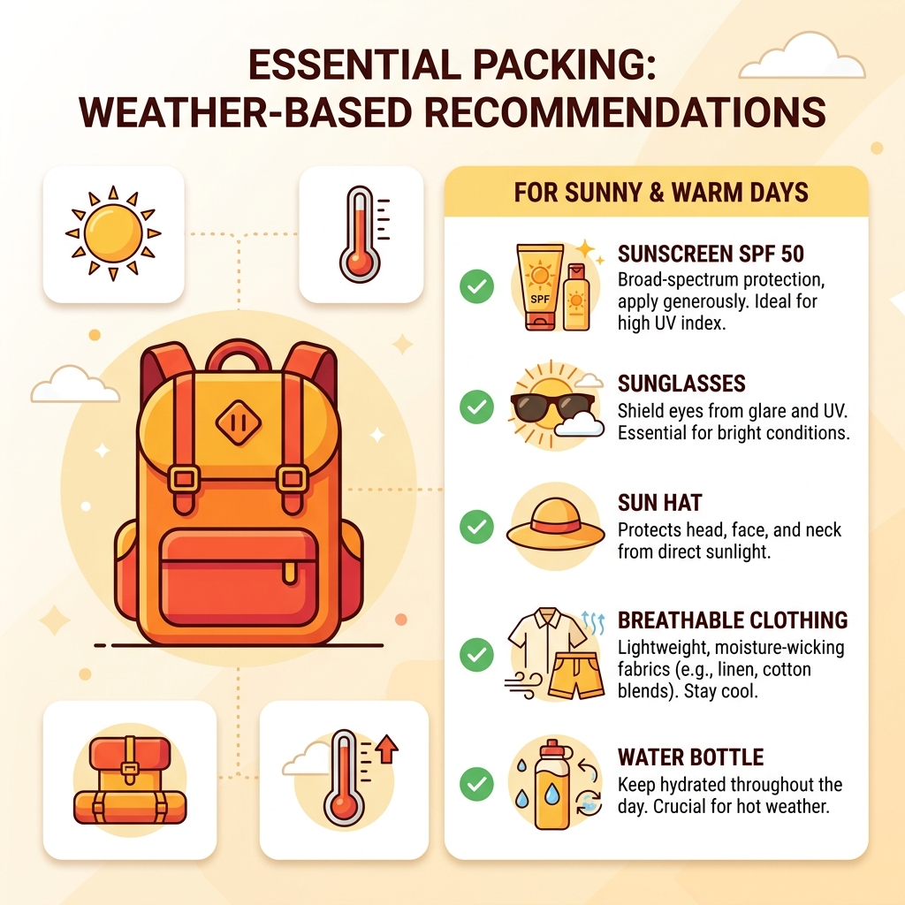

# Weather & Packing Planner 🌦️🎒

A highly polished, responsive Single Page Application (SPA) that functions as an interactive weather dashboard and automated packing list planner. Built in accordance with **Google Material Design 3** guidelines, it matches ambient themes to live weather conditions.

---

## 📸 Interface Preview & Logic

### 1. Interactive Weather Dashboard

*A preview of the dashboard demonstrating modern grids, large temperature display, feels-like indicator, detailed secondary conditions (humidity, wind, pressure, sunrise/sunset), and the cascades of 3-Day Forecast cards.*

### 2. Smart Packing Recommendation Engine

*How the packing list adapts: checks live conditions (rain, heat index, wind, snow) and recommends appropriate gear like sunscreen, sunglasses, hats, breathable clothing, umbrellas, or coats, plus travel essentials.*

---

## ✨ Key Features

- **Google Material Design 3**: Modern cards, 16–24px rounded corners, soft shadows, hover transitions, and clean typography.
- **Geocoding Search Autocomplete**: Offers instant city suggestions matching `City, State, Country` format as you type.
- **Full Keyboard Accessibility (A11y)**: Navigate search suggestions using `ArrowUp` / `ArrowDown` and select with `Enter` or cancel with `Escape`. Includes visible focus indicators.
- **Dynamic Theming**: Automatically shifts primary, secondary, and background colors to fit current weather conditions:
  - ☀️ **Clear/Sunny** -> Amber/Orange Theme
  - ☁️ **Cloudy** -> Slate Gray Theme
  - 🌧️ **Rainy/Drizzle** -> Cool Blue Theme
  - ❄️ **Snowy** -> Ice Blue Theme
  - ⛈️ **Thunderstorm** -> Deep Purple Theme
  - 🌫️ **Mist/Haze/Fog** -> Charcoal Gray Theme
- **Packing Planner Rule Engine**: Calculates checklist recommendations dynamically. Allows marking items completed, which persist on browser refresh.
- **3-Day Forecast Aggregation**: Groups three-hour predictions to output accurate minimum and maximum temperatures and noon icons for future days.
- **Secure Configuration**: Reads OpenWeather keys from a gitignored local `.env` configuration file, avoiding API key leaks.
- **Settings Modal**: Instantly update API keys or toggle units between Celsius (°C) and Fahrenheit (°F) on the fly.

---

## 🛠️ Tech Stack

- **Core**: Vanilla HTML5 (semantic tags) & JavaScript (ES6+).
- **Styling**: Vanilla CSS3 (Custom Variables, CSS Grids, Flexbox, Keyframe animations).
- **Icons**: Google Material Symbols Font.
- **Geocoding & Weather APIs**: OpenWeatherMap API (Current, 5-Day Forecast, Direct Geocoding).

---

## 🚀 Getting Started

### 1. Prerequisites
You need an API key from [OpenWeatherMap](https://openweathermap.org/).

### 2. Installation & Setup
1. Clone the repository:
   ```bash
   git clone https://github.com/Geltrax69/OpenWeather.git
   cd OpenWeather
   ```
2. Create a `.env` file in the root directory:
   ```env
   OPENWEATHER_API_KEY=your_openweather_api_key_here
   ```

### 3. Running Locally
Run a lightweight local HTTP server (to allow the app to fetch `.env` file configuration):

**Using Python:**
```bash
python3 -m http.server 8000
```
Open **[http://localhost:8000](http://localhost:8000)** in your browser.

---

## 🌐 Deployments

### A. Deploy to Vercel (Recommended - Secure API Proxy)
This project is configured with Vercel Serverless Functions in the `api/` directory. Deploying on Vercel serves as a secure proxy, keeping your OpenWeather API key 100% hidden from client-side browser network inspectors:

1. Import your GitHub repository into Vercel.
2. In Vercel Project Settings, navigate to **Environment Variables** and add:
   - **Name**: `OPENWEATHER_API_KEY`
   - **Value**: `7b31c2f1ba62f69d07ed0f204b8ab14c`
3. Deploy the project. The frontend will automatically detect the Vercel environment, bypass local `.env` requirements, and query endpoints safely through `/api/weather`, `/api/forecast`, and `/api/geocoding`.

### B. Deploy to GitHub Pages (Static Direct Query Fallback)
The app can also be hosted on GitHub Pages:
1. Go to your repository **Settings** -> **Pages**.
2. Under **Build and deployment**, select **Deploy from a branch**.
3. Set the branch to **`main`** and folder to **`/ (root)`**, then click **Save**.

*(Note: Because the `.env` file is gitignored, the GitHub Pages deployment will default to an empty API key state. Visitors can enter their own active OpenWeather API key securely via the **Settings** cog in the top-right corner).*
